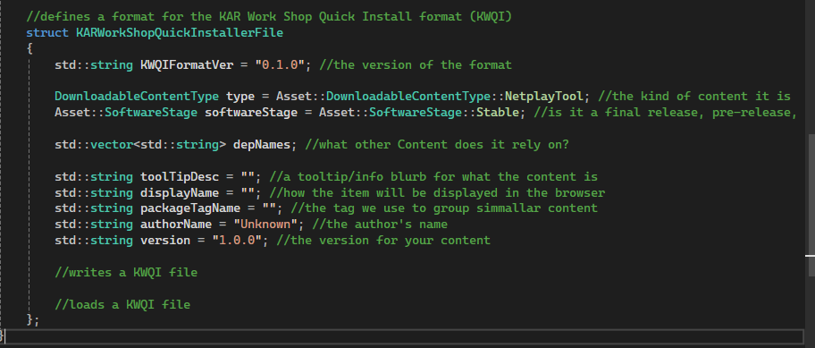

# KAR-KWQI
The Kirby Air Ride Workshop Quick Install format, is a custom file format for installing KAR Netplay tools and mods.

# Version 0.1.0
The first pre-release of the Kirby Air Ride Workshop Quick Install format spec.

Any parser for KWQI must meet this spec to properly parse the data. KWQI is a text YAML format that allows tools and mods for KAR Netplay to quickly be downloaded and managed.